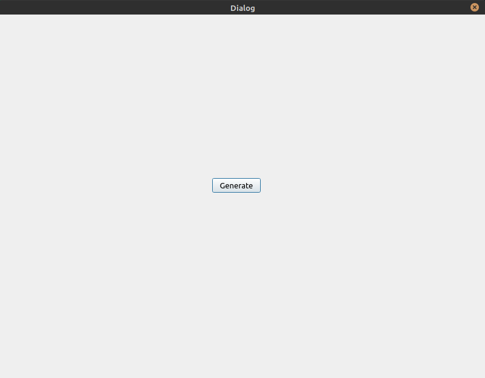
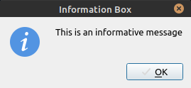
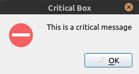
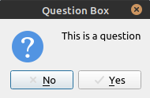
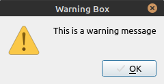
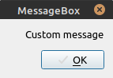
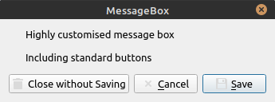

## Introduction

In this tutorial, we will learn different ways we can use **QMessageBox** class.

QMessageBox is a modal dialog i.e. user input is required in order to continue working with the application. To put it simply, It informs the user with a message and expects an answer. Modal windows block user inputs to background windows until the message box has an answer.

The message itself, can be a warning, question, information or a question. QMessageBox provides us with 2 different types of APIs, property-based API and static functions API. Both the APIs can be used based on the actual need of the situation.

## Motivation

Static functions API is built-in easy to use approach. Whereas, property-based API provides much more flexible and customizable option. In this tutorial, we will try both the options.

## Tutorial

In this example, we'll use QMessageBox in 2 different ways as discussed above.

```JS

#include "dialog.h"
#include "ui_dialog.h"
#include <QMessageBox>

Dialog::Dialog(QWidget* parent)
    : QDialog(parent)
    , ui(new Ui::Dialog)
{
    ui->setupUi(this);
}

Dialog::~Dialog()
{
    delete ui;
}


void Dialog::on_pushButton_clicked()
{
    // using static api
    // not much flexibility
    QMessageBox::information(this, "Information Box", "This is an informative message");
    QMessageBox::critical(this, "Critical Box", "This is a critical message");
    QMessageBox::question(this, "Question Box", "This is a question");
    QMessageBox::warning(this, "Warning Box", "This is a warning message");

    // using message box instances
    // very flexible and highly customizable
    QMessageBox msgBox;
    msgBox.setText("Custom message");
    msgBox.exec();

    QMessageBox msgBox2;
    msgBox2.setText("Highly customised message box");
    msgBox2.setInformativeText("Including standard buttons");
    msgBox2.setStandardButtons(QMessageBox::Save |
                               QMessageBox::Discard |
                               QMessageBox::Cancel);
    msgBox2.setDefaultButton(QMessageBox::Save);
    msgBox2.exec();
}
```

<br />

Our **Dialog.cpp** contains a single button **Generate** as shown in the image



<br />

Clicking on **Generate** button, creates message boxes in an order.













<br />

We can always use convenient static functions API but it lacks a detailed informative text parameter. If the user needs to be alerted about the situation with a descriptive message, we must use property-based API, wherein we can not only convey a detailed informative message to the user but also ask the user what to do about this situation. User input must be subsequently handled there after.

This whole project can be found on my [GitHub](https://github.com/SurKM9/MessageBox) account.

## Conclusion

Feel free to share this blog, if you feel it helped you. If you have any comments or suggestions, post it in the comments section below.

<span>Photo by <a href="https://unsplash.com/@andrewmeasham?utm_source=unsplash&amp;utm_medium=referral&amp;utm_content=creditCopyText">Andrew Measham</a> on <a href="https://unsplash.com/s/photos/message?utm_source=unsplash&amp;utm_medium=referral&amp;utm_content=creditCopyText">Unsplash</a></span>
