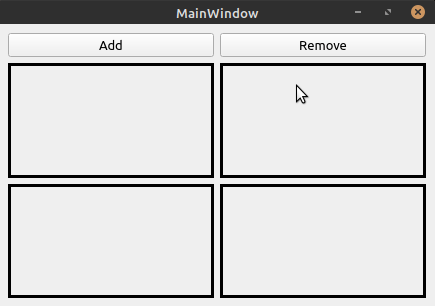

## Introduction

Imagine we want to add multiple widgets in `QGridLayout` dynamically but also remove widgets on the fly. Adding widgets to grid layout is pretty straight forward but removing widgets is the tricky part. In this tutorial we will see how to achieve the same.

## Goal

Our would be to design a simple UI with buttons which enable us to achieve adding and removing widgets from a grid layout dynamically. Our application would ultimately look like this:

Photo by <a href="https://unsplash.com/@chatelp?utm_source=unsplash&amp;utm_medium=referral&amp;utm_content=creditCopyText">Pierre Châtel-Innocenti</a> on <a href="https://unsplash.com/s/photos/grid?utm_source=unsplash&amp;utm_medium=referral&amp;utm_content=creditCopyText">Unsplash</a>