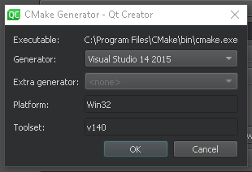
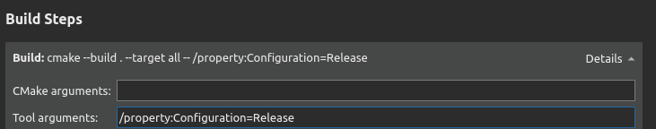

## Introduction

Configuring medium-sized to large CMake projects in Qt Creator can be a challenge. I realized configuring my medium sized project in Qt Creator with MSVC 2015 is not straight forward. Until, I found out that there are some issues with MS build which Qt Creator doesn't recognize.

## What's the problem?

Qt Creator builds debug version even when `CMAKE_BUILD_TYPE` is set to `RELEASE`.

## Setup and Configuration

I have setup Visual Studio 14 2015 as my default generator for cmake projects in Qt Creator. So, my setup looks something like this:

We can configure our cmake variables the way we like it. Configuration and generation works fine. We encounter an issue when we start building the project in release configuration only to find that Qt Creator builds a debug version of the project.

This is an issue with ms build. To avoid this, we need to explicitly pass a cmake argument to let cmake build a release version. The build configuration for ms build would look like this `/property:Configuration=Release`. This argument can be added to the build steps of release configuration in Qt Creator as shown in the image below:

This should fix the issue of generating a proper release build for the project using MSVC 2015 generator in Qt Creator.

## Conclusion

If this was helpful, please share this blog and also feel free to add your thoughts or comments below.